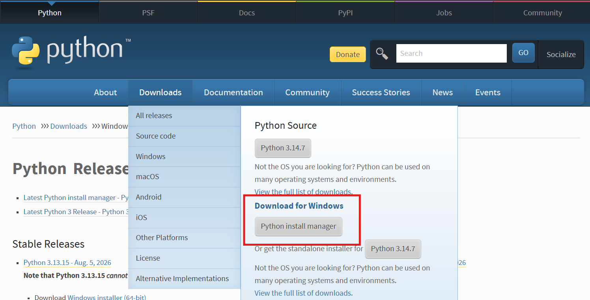

# How to use NumGen ➕!

## Environment Setup

###Installing Python

To use NumGen ➕ we need to install Python 🐍! Let's [download](https://www.python.org/) Python from [python.org!](https://www.python.org/). 
If your are a windows user, click the button encircled in red!

If you are a macOS user, click the button boxed in red!

The latest install now requires to download the **Python Install Manager 🐍** or **PyManager 🐍** 
It will look something like this
